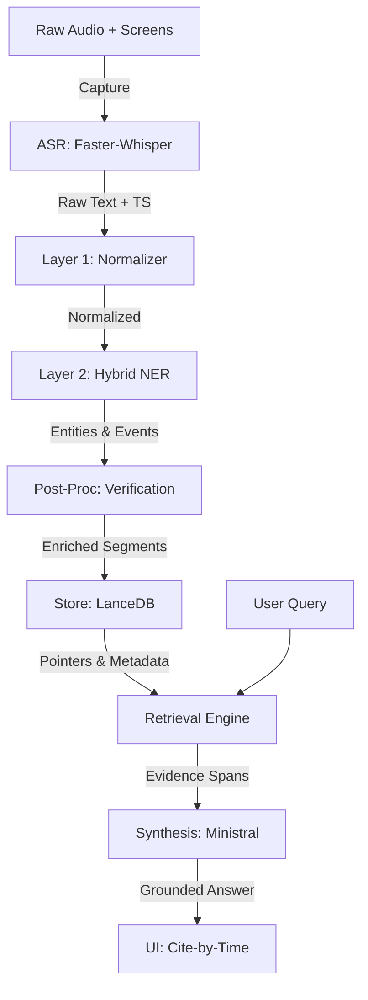

# EchoPanel: End-to-End Pipeline Data Flow (v0.3 Specification)

This document describes how data flows from raw audio capture to grounded intelligence, prioritizing **evidence pointers** as the primary source of truth.

## 0. High-Level Data Chain

---

## 1. Dual-Speed Execution Modes

EchoPanel adapts its workload based on the meeting's state:

### Live Mode (Streaming Intelligence)
- **Goal**: Instant awareness, action item alerts, and "last 2 minutes" summary.
- **ASR**: 1-2s chunking.
- **NER**: Light models (`en_core_web_lg`) for <100ms latency.
- **RAG**: **Incremental Ingestion**. Chunks are indexed into LanceDB as they arrive.
- **Vision**: **ScreenCaptureKit** snapshots (1fps) + **pHash** Change Detection + **Apple Vision** (Fast OCR).

### Archival Mode (High-Precision Post-Processing)
- **Goal**: Final summary, searchable knowledge base, and grounded decision audit.
- **ASR**: Full-pass verification (multi-pass decoding).
- **NER**: Heavy models (`en_core_web_trf`) and full `GLiNER` passes.
- **RAG**: **Full Index Optimization**. Rerunning hybrid search with cross-encoders.
- **Vision**: **LightOnOCR-2-1B** (Structure) + **SmolVLM2** semantic summaries on promoted keyframes.
- **RAG**: Global cross-meeting index optimization.
- **Goal**: High-fidelity summaries, semantic search, and technical audits.

---

## 2. Evidence Ladder (Query Routing)

EchoPanel routes queries through different "rung" paths depending on the artifacts present:

| Artifacts | Retrieval Strategy (The Path) |
| :--- | :--- |
| **Transcript Only** | Hybrid Search (Dense+Sparse) → Top 50 → Rerank → Synthesis. |
| **+ Diarization** | `speaker_id` Match → Filtered Semantic Search → Synthesis. |
| **+ NER** | Entity Extract (Query) → Entity Index Match → Candidate Slice → Search. |
| **+ Events** | Direct Object Lookup (Actions/Decisions Table) → Pointer Verification. |
| **+ Visuals** | Time-Correlation Switch → Multi-source Synthesis (Text + Frame Summary). |

---

## 3. Data Life Cycle: "Decision" Example
1. **Audio**: "...uh, lets move to BGE-M3 for the embedding layer today."
2. **ASR**: `BGE-M3` (45.3s).
3. **Normalizer**: Fixes transcript casing and removes filler "uh".
4. **NER**: Detects `BGE-M3` as `TECH_TERM` and the sentence as a `DECISION` Hypothesis.
5. **RAG Ingestion**: Stores in LanceDB with `pointers.t0 = 45.3`.
6. **Query**: "What embedding model are we using?"
7. **Synthesis**: Finds the `TECH_TERM` pointer, verifies the `DECISION` bit, and outputs: *"We are using BGE-M3 (confirmed at 45.3s)."*
